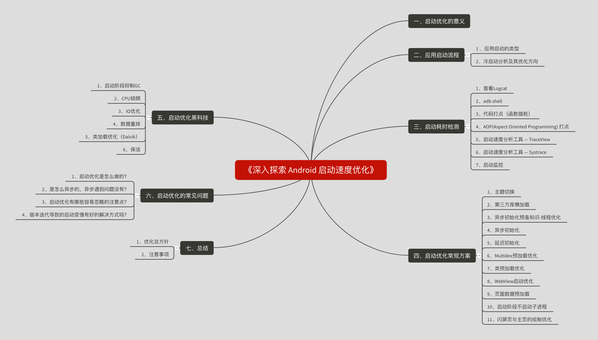
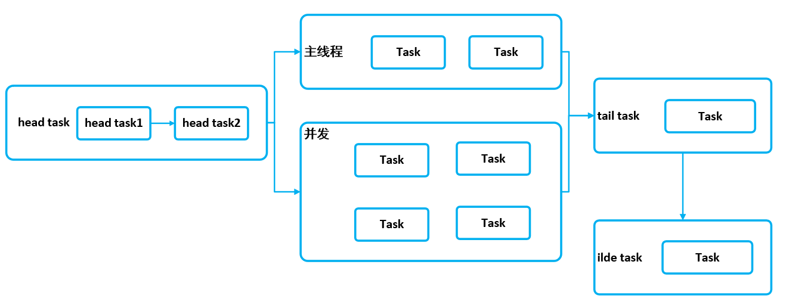

# 深入探索Android启动速度优化

https://juejin.im/post/5e6f18a951882549422ef333#heading-95

# 前言

### 成为一名优秀的Android开发，需要一份完备的[知识体系](https://github.com/JsonChao/Awesome-Android-Exercise)，在这里，让我们一起成长为自己所想的那样~。

在性能优化的整个知识体系中，最重要的就是稳定性优化，在上一篇文章 [《深入探索Android稳定性优化》](https://juejin.im/post/5e69a4fd51882549003d2f0e) 中我们已经深入探索了Android稳定性优化的疆域。那么，**除了稳定性以外，对于性能纬度来说，哪个方面的性能是最重要的呢**？毫无疑问，就是**应用的启动速度**。下面，**就让我们扬起航帆，一起来逐步深入探索Android启动速度优化的奥秘**。

# 思维导图大纲



# 第3章 App启动优化

> App启动速度是用户的第一印象，本章会介绍精准度量启动速度的方式，启动优化的相关工具、常规优化手段等，同时我会介绍异步初始化以及延迟初始化的最优解，以最优雅、可维护性高的的方式获得闪电般的启动速度。...

## 3-3 启动时间测量方式

### 3.3.1 adb命令

* adb shell am start -W packagename/首屏Activity
  * ThisTime: 最后一个Activity启动耗时
  * TotalTime: 所有Activity启动耗时
  * WaitTime: AMS启动Activity的总耗时
* 缺点：
  * 线下使用方便，不能带到线上
  * 非严谨、精确时间

### 3.3.2 手动打点

* 启动时埋点，启动结束埋点，二者差值
* 误区：onWindowFocusChanged只是首帧时间
* 正解：真实数据展示，Feed（列表数据）第一条展示
  * 精准，可带到线上，推荐使用
  * 避开误区，采用Feed第一条展示

### 3.3.3 总结

* 启动时间测量的两种方式
* 严谨真实的启动时间（误区）


## 3-4 启动优化工具选择-1

两种工具：traceView、systrace

**注意**

* 两种方式互相补充
* 正确认识工具及不同场景选择合适的工具

### 3.4.1 traceView

* 图形的形式展示执行时间、调用栈等
* 信息全面，包含所有线程
* 使用方式
  * Debug.startMethodTracing("文件名");
  * Debug.stopMethodTracing();
  * 生成文件在sd卡：Android/data/packagename/files

#### 3.4.1.1指标解读

Call Chart

* 横向：函数调用时间段消耗
* 竖向：函数调用关系

Flame Chart: 倒置的调用图表

Top Down：函数的调用列表

* Wall Clock Time：线程真正执行的时间
* Thread Time: CPU执行时间

Bottom Up：一个函数的调用列表（与Top Down相反）

**重点关注**：Call Chart、Top Down

#### 3.4.1.2 traceView缺点

* 运行时开销严重，整体都会变慢
* 可能会带偏优化方向
* traceView与cpu profiler

### 3.4.2 systrace

* 结合Android内核的数据，生成Html报告
* API 18以上使用，推荐TraceCompat（向下兼容类）

#### 3.4.2.1 使用方式

* python systrace.py -t 10 [other-options] [categories]
* https://developer.android.com/studio/command-line/systrace#command_options

#### 3.4.2.2 优点

* 轻量级，开销小
* 直观反映cpu利用率

#### 3.4.2.3 cputime与walltime区别

* walltime是代码执行时间
* cputime是代码消耗cpu的时间（重点指标）
* 举例：锁冲突


##  3-6 优雅获取方法耗时讲解

### 3.6.1 常规方式

* 背景：需要知道启动阶段所有方法耗时
* 实现：手动埋点

**具体实现**

* long time = System.currentTimeMillis();
* long cost = System.currentTimeMillis() - time;
* 或者SystemClock.currentThreadMillis();

**缺点**

* 侵入性强
* 工作量大

### 3.6.2 AOP介绍

* Aspect Oriented Programming，面向切面编程
  * 针对同一类问题的统一处理
  * 无侵入添加代码
* 优点
  * 无侵入性
  * 修改方便

### 3.6.3 AspectJ使用

* classpath 'com.hujiang.aspectjx:gradle-android-plugin-aspectjx:2.0.0'
* implementation 'org.aspectj:aspectjrt:1.8.+'
* apply plugin: 'android-aspectjx'

#### 3.6.3.1 Join Points

* 程序运行时的执行点，可以作为切面的地方
  * 函数调用、执行
  * 获取、设置变量
  * 类初始化

#### 3.6.3.2 PointCut

* 带条件的JoinPoints

#### 3.6.3.3 Advice

* 一种Hook，要插入代码的位置
  * Before: PointCut之前执行
  * After: PointCut之后执行
  * Around: PointCut之前、之后分别执行

#### 3.6.3.4 语法简介

```java
@Before("excution(* android.app.Activity.on**(..))")
public void onActivityCalled(JoinPoint joinPoint) throws Throwable {
    .....
}
```

* Before: Advice，具体插入位置
* execution: 处理Join Point的类型，call、execution
* (* android.app.Activity.on**(..)): 匹配规则
* onActivityCalled: 要插入的代码

## 3-7 优雅获取方法耗时实操

```java
@Aspect
public class PerformanceApp {
    @Around("call(* com.optimize.performance.PerformanceApp.**(..))")
    public void getTime(ProceedingJoinPoint joinPoint) {
        Signature signature = joinPoint.getSignature();
        String name = signature.toShortString();
        long time = System.currentTimeMillis();
        try {
            joinPoint.proceed();
        } catch (Throwable throwable) {
            throwable.printStackTrace();
        }
        LogUtils.i(name + " cost " + (System.currentTimeMillis() - time));
    }
}
```

### 总结

* 优雅获取方法耗时的方式
* AOP的理解及使用

## 3-8 异步优化详解

**优化小技巧**

* Theme切换：感觉上的快

```xml
<layer-list>
	<item android:drawable="@android:color/white" />
    <item>
    	<bitmap
           android:src="@drawable/product_logo_144p"
           android:gravity="center"/>
    </item>
</layer-list>
```


```xml
<activity...
android:theme="@style/AppTheme.Launcher" />

@Override
protected void onCreate(Bundle savedInstanceState) {
	//super.onCreate之前切换回来
	setTheme(R.style.Theme_MyApp);
	super.onCreate(savedInstanceState);
}
```

**异步优化**

* 核心思想：子线程分担主线程任务，并行减少时间
  * 首先根据CPU核数来确定线程池中的线程个数
  * 然后创建指定线程个数的线程池，将主线程任务放入其中

```java
public final CPU_COUNT = Runtime.getRuntime().availableProcessors();
public final int CORE_POOL_SIZE = Math.max(2, Math.min(CPU_COUNT - 1), 4);
public final int MAXIMUM_POOL_SIZE = CPU_COUNT * 2 + 1;

@Override
public void onCreate() {
    super.onCreate();
    mApplication = this;
    LaunchTimer.startRecord();
    ExecutorService service = Executors.newFixedThreadPool(CORE_POOL_SIZE);
    service.submit(new Runnable() {
       @Override
        public void run() {
            // Bugly
            initBugly();
        }
    });
    
    service.submit(new Runnable() {
       @Override
        public void run() {
            // 高德地图
            initAMap();
        }
    });
    
    LaunchTimer.endRecord();
}
```

**异步优化注意**

* 不符合异步要求
* 需要再某阶段完成
* 区分CPU密集型和IO密集型任务

**不符合异步要求**

如果初始化代码中包含必须在主线程执行的内容，此时需要修改初始化代码块，如果是第三方SDK，无法修改其内容，则使用第二种方案

方案一：修改初始化代码块

```java
private void initStetho() {
    Handler handler = new Handler(Looper.getMainLooper());
    Stetho.initializeWithDefaults(this);
}
```

**需要在某阶段完成**

方案二：使用CountDownLatch

```java
private CountDownLatch mCountDownLatch = new CountDownLatch(1);

@Override
public void onCreate() {
    super.onCreate();
    mApplication = this;
    LaunchTimer.startRecord();
    ExecutorService service = Executors.newFixedThreadPool(CORE_POOL_SIZE);
    service.submit(new Runnable() {
       @Override
        public void run() {
            // Bugly
            initBugly();
            mCountDownLatch.countDown();
        }
    });
    
    service.submit(new Runnable() {
       @Override
        public void run() {
            // 高德地图
            initAMap();
        }
    });
    try {
        mCountDownLatch.await();
    } catch (InterruptedException e) {
        e.printStackTrace();
    }
  
    LaunchTimer.endRecord();
}
```


## 3-9 异步初始化最优解-启动器-1

* 常规异步痛点
  * 代码不优雅
  * 场景不好处理（依赖关系）
  * 维护成本高
* 启动器介绍
* 启动器实战

### 启动器介绍

* 核心思想：充分利用CPU多核，自动梳理任务顺序
  * 关键字：充分、自动

### 启动器流程

* 代码Task优化，启动逻辑抽象为Task
* 根据所有任务依赖关系排序生成一个有向无环图
* 多线程按照排序后的优先级依次执行

### 启动器流程图



### 启动器代码

com.optimize.performance.launchstarter

TaskDispatcher.java

TaskSortUtil.java

## 3-10 异步初始化最优解-启动器-2

代码略

## 3-11 更优秀的延迟初始化方案

**常规方案**

* New Handler().postDelayed
* Feed展示后调用

**常规初始化痛点**

* 时机不便控制
* 导致Feed卡顿

**更优方案**

* 核心思想：对延迟任务进行分批初始化
  * 利用IdleHandler特性，空闲执行
* 执行时机明确
* 缓解Feed卡顿

**总结**

* 真正提升用户体验

## 3-12 启动优化其它方案

**优化总方针**

* 异步、延迟、懒加载
* 技术、业务相结合

**注意事项**

* wall time与cpu time
  * cpu time才是优化方向
  * 按照systrace及cpu time跑满cpu

* 监控的完善
  * 线上监控多阶段时间（App、Activity、生命周期间隔时间）
  * 处理聚合看趋势

* 收敛启动代码修改权限
  * 结合Ci修改启动代码需要Review或通知

**其他方案**

* 提前加载SharedPreferences
  * Multidex之前加载，利用此阶段CPU
  * 覆写getApplicationContext()返回this
* 启动阶段不启动子进程
  * 子进程会共享CPU资源，导致主进程CPU紧张
  * 注意启动顺序：App onCreate 之前是ContentProvider
* 类加载优化：提前异步类加载
  * Class.forName() 只加载类本身及静态变量的引用类
  * new 类实例 可以额外加载类成员变量的引用类
  * 如何查找哪些类需要异步加载呢？
    * 替换掉系统的classloader，在自定义的classloader中打印log，记录每一个类load时所消耗的时间
* 启动阶段抑制GC
* CPU锁频

**总结**

* 优化方针及注意事项
* 其他方案

## 3-13 启动优化方案总结

* 获取方法耗时
  * 常规方案
  * AOP
  * wall time与cpu time区别

* 异步初始化
  * 常规异步
  * 启动器
  * 注意痛点及启动器优势的理解
* 延迟初始化
  * 常规方案
  * 结合IdleHandler

* 其他方案
  * 提前异步SharedPreferences
  * 启动阶段不启动子进程
  * 提前异步类加载

## 3-14 启动速度模拟面试

### 3.14.1 你做启动优化是怎么做的？

* 分析现状、确认问题
* 针对性优化
* 长期保持优化效果

### 3.14.2 你是怎么异步的？异步遇到问题没有

* 体现演进过程
* 详细介绍启动器

### 3.14.3 你做了启动优化，觉得有哪些容易忽略的注意点

* cpu time与wall time
* 注意延迟初始化的优化
* 介绍下黑科技（类加载优化，详见3.12 其他方案）

### 3.14.4 版本迭代导致的启动变慢有好的解决方式吗？

* 启动器
* 结合CI
* 监控完善

## 4-2 内存优化介绍及工具选择

### 4.2.1 背景介绍

* 内存是大问题但缺乏关注
* 压死骆驼的最后一根稻草

### 4.2.2 内存问题

* 内存抖动：锯齿状、GC导致卡顿
* 内存泄漏：可用内存减少、频繁GC
* 内存溢出：OOM、程序异常

### 4.2.3 工具选择

* Memory Profiler
  * 实时图表展示应用内存使用量
  * 识别内存泄漏、抖动等
  * 提供捕获堆转储、强制GC以及跟踪内存分配的能力
* Memory Analyzer
  * 强大的Java Heap分析工具，查找内存泄漏及内存占用
  * 生成整体报告、分析问题等
  * 线下深入使用
* LeakCanary
  * 自动内存泄漏检测
  * https://github.com/square/leakcanary
  * 线下集成

## 4-3 Android内存管理机制

### 4.3.1 Java 内存管理机制

### 4.3.1.1 Java内存分配

* #### 方法区

* 虚拟机栈

* 本地方法栈

* 堆

* 程序计数器具

#### 4.3.1.2 Java内存回收算法

* a、标记-清除算法
  * 标记出所有需要回收的对象
  * 统一回收所有被标记的对象
  * 缺点：
    * 标记和清除效率不高
    * 产生大量不连续的内存碎片
* b、复制算法
  * 将内存划分为大小相等的两块
  * 一块内存用完之后复制存活对象到另一块
  * 清理另一块内存
  * 优缺点：
    * 实现简单、运行高效
    * 浪费一半空间，代价大
* c、标记-整理算法
  * 标记过程与“标记-清除”算法一样
  * 存活对象往一端移动
  * 清理其余内存
  * 优缺点：
    * 避免标记-清理导致的内存碎片
    * 避免复制算法的空间浪费
* d、分代收集算法
  * 结合多种收集算法优势
  * 新生代对象存活率低：采用标记-复制
  * 老年代对象存活率高：采用标记-整理

### 4.3.2 Android内存管理机制

* 内存弹性分配，分配值与最大值受具体设备影响
* OOM场景：内存真正不足、可用内存不足

### 4.3.2.1 Dalvik与Art区别

* #### Dalvik仅固定一种回收算法

* Art回收算法可运行期选择

* Art具备内存整理能力，减少内存空洞

#### 4.3.2.2 Low Memory Killer

* 进程分类
  * 前台进程
  * 可见进程
  * 服务进程
  * 后台进程
  * 空进程
* 回收收益

## 4-4 内存抖动解决实战

**内存抖动介绍**

* 定义：内存频繁分配和回收导致内存不稳定
* 表现：频繁GC、内存曲线呈锯齿状
* 危害：导致卡顿、OOM

**内存抖动导致OOM**

* 频繁创建对象，导致内存不足及碎片（内存不连续）
* 不连续的内存片无法被分配，导致OOM

**内存抖动解决实战**

* 使用Memory Profiler初步排查
* 使用Memory Profiler或CPU Profiler结合代码排查

**内存抖动解决技巧**

找循环或者频繁调用的地方

## 4-5 内存泄露解决实战

### 4.5.1 内存泄漏介绍

* 定义：内存中存在已经没有用的对象
* 表现：内存抖动、可用内存逐渐变少
* 危害：内存不足、GC频繁、OOM

### 4.5.2 Memory Analyzer

* https://www.eclipse.org/mat/downloads.php
* 转换：hprof-conv 原文件路径 转换后文件路径

### 4.5.2 内存泄漏解决实战

* 使用Memory Profiler初步观察
* 通过Memory Analyzer结合代码确认

## 4-6 全面理解MAT

MAT工具的全面理解及使用

## 4-7 ARTHook优雅检测不合理图片

### 4.7.1 Bitmap内存模型

* API10之前Bitmap自身在Dalvik Heap中，像素在Native
* API10之后像素也被放在Dalvik Heap中
* API26之后像素在Native

**获取Bitmap占用内存**

* getByteCount
* 宽 * 高 * 一像素占用内存

### 4.7.2 常规方式

* 背景：图片对内存优化至关重要、图片宽高大于控件宽高
* 实现：继承ImageView，覆写实现计算大小
* 缺点：
  * 侵入性强
  * 不通用

### 4.7.3 ARTHook介绍

* 挂钩，将额外的代码钩住原有方法
  * 运行时插桩
  * 性能分析

#### 4.7.4.1 Epic简介

* Epic是一个虚拟机层面，以Java Method为粒度的运行时Hook框架
* 支持Android4.0 ~ 10
* https://github.com/tiann/epic

#### 4.7.4.2 Epic使用

* compile 'me.weishu:epic:0.6.0'
* 继承XC_MethodHook，实现相应逻辑
* 注入Hook：DexposedBridge.findAndHookMethod

#### 4.7.4.3 ARTHook实现

* 无侵入性
* 通用性强
* 兼容问题大，开源方案不能带到线上环境

### 4.7.4 总结

* Bitmap内存模型
* 优雅检测不合理图片的方式
* ARTHook的理解及使用

## 4-8 线上内存监控方案

> 目录：
>
> 常规方式
>
> LeakCanary定制
>
> 线上监控完整方案

### 4.8.1 常规实现一

设定场景线上Dump：Debug.dumpHprofData()

**常规实现流程**

超过最大内存80%   →   内存Dump

​												↓

MAT手动分析          ←    回收文件（WiFi上传）

**方案一总结**

* Dump文件太大，和对象数正相关，可裁剪（通过NativeHook的方式）
* 上传失败率高、分析困难
* 配合一定策略，有一定效果

### 4.8.2 常规实现二

* LeakCanary带到线上
* 预设泄漏怀疑点
* 发现泄漏回传

**方案二总结**

1. 不合适所有情况，必须预设怀疑点
2. 分析比较耗时，也容易OOM

**LeakCanary原理**

* 监控生命周期，onDestroy添加RefWatcher检测
* 二次确认断定发生内存泄漏
* 分析泄漏，找引用链
* 监控组件+分析组件

**LeakCanary定制**

1. 预设怀疑点 → 自动找怀疑点
2. 分析泄漏链路慢  → 分析Retain size大的对象
3. 分析OOM → 对象裁剪，不全部加载到内存

### 4.8.3 线上监控完整方案

* 待机内存、重点模块内存、OOM率
* 整体及重点模块GC次数、GC时间
* 增强的LeakCanary自动化内存泄漏分析

## 4-9 内存优化技巧总结

### 优化大方向

* 内存泄漏
* 内存抖动
* Bitmap

### 优化细节

* LargeHeap属性
* onTrimMemory
* 使用优化过的集合：SparseArray
* 谨慎使用SharedPreference
* 谨慎使用外部库
* 业务架构设计合理

## 4-10 内存优化模拟面试

1. 你们内存优化项目的过程是怎么做的？
   * 分析现状、确认问题
   * 针对性优化
   * 效率提升（做了哪些工作提升了效率，比如编写了一系列优化解决方案的文档分享给大家）
2. 你做了内存优化最大的感受是什么？
   * 磨刀不误砍柴工
     * 首先系统学习谷歌官方文档以及Memory Profiler、MAT工具的使用，将这些工具熟练使用之后，然后在项目当中遇到了一些问题，我们就能迅速的排查定位进行解决
   * 技术优化必须结合业务代码
     * 梳理是否存在多个图片库，因为他们的内存缓存不共用，会导致整个项目bitmap内存使用量非常高
   * 系统化完善解决方案
     * 突破线下使用的限制，安卓端采集数据上报服务器，便于Bug、crash跟踪人员进行一系列问题的解决

3. 如何检测所有不合理的地方？
   * ARTHook
   * 重点强调它与其他方案的区别
     * 讲一下演进过程，最初的设计是继承ImageView，覆写它的onDraw方法，但是呢，在推广过程中，很多开发人员不愿意接受，因为很多ImageView之前已经写好了，现在让其替换，这个成本是很高的，后来呢，我们就思考，有没有一种方案是免替换的，最终我们找到了ARTHook这个方案

