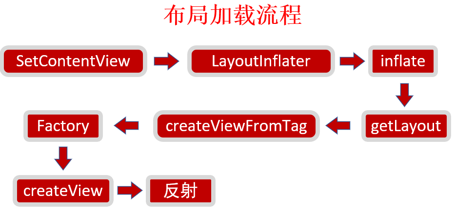

# 第5章 App布局优化

> 本章主要介绍了Android的绘制原理并结合源码带大家分析Android布局加载过程，并且介绍一种优雅获取界面布局耗时的方式，异步Inflate以及Xml布局转Java的方式是从不同的思路缩短布局的耗时。
>
> # 深入探索Android布局优化（上）
>
> https://juejin.im/post/5e1d15a851882536ca666a49
>
> ## 前言
>
> #### 成为一名优秀的Android开发，需要一份完备的[知识体系](https://github.com/JsonChao/Awesome-Android-Exercise)，在这里，让我们一起成长为自己所想的那样~。
>
> Android的绘制优化其实可以分为两个部分，即**布局(UI)优化和卡顿优化**，而布局优化的核心问题就是要解决因布局渲染性能不佳而导致应用卡顿的问题，所以它可以认为是卡顿优化的一个子集。对于Android开发来说，写布局可以说是一个比较简单的工作，但是如果想将写的每一个布局的渲染性能提升到比较好的程度，要付出的努力是要远远超过写布局所付出的。由于布局优化这一主题包含的内容太多，因此，笔者将它分为了上、下两篇，本篇，即为深入探索Android布局优化的上篇。本篇包含的主要内容如下所示：
>
> - 1、绘制原理
> - 2、屏幕适配
> - 3、优化工具
> - 4、布局加载原理
> - 5、获取界面布局耗时
>
> 说到Android的布局绘制，那么我们就不得不先从布局的绘制原理开始说起。
>
> # 深入探索Android布局优化（下）
>
> https://juejin.im/post/5e1e6cf66fb9a0301828ca0a
>
> ## 前言
>
> #### 成为一名优秀的Android开发，需要一份完备的[知识体系](https://github.com/JsonChao/Awesome-Android-Exercise)，在这里，让我们一起成长为自己所想的那样~。
>
> 在上篇文章中，笔者带领大家学习了布局优化涉及到的绘制原理、优化工具、监测手段等等知识。如果对这块内容还不了解的建议先看看[《深入探索Android布局优化（上）》](https://juejin.im/post/5e1d15a851882536ca666a49)。本篇，为深入探索Android布局优化的下篇。这篇文章包含的主要内容如下所示：
>
> - 6、布局优化常规方案
> - 7、布局优化的进阶方案
> - 8、布局优化的常见问题
>
> 下面，笔者将与大家一起进入进行布局优化的实操环节。

##  5-2 Android绘制原理及工具选择

**绘制原理**

* CPU负责计算显示内容
* CPU负责栅格化（UI元素绘制到屏幕上）
* 16ms发出VSync信号触发UI渲染
* 大多数的Android设备屏幕刷新频率：60Hz

**优化工具**

* Systrace

  * 关注Frames
  * 正常：绿色圆点，丢帧：黄色或红色
  * Alerts栏

* Layout Inspector

  * AndroidStudio自带工具
  * 查看视图层次结构

* Choreographer

  * 获取FPS，线上使用，具备实时性
  * Api 16之后
  * Choreographer.getInstance().postFrameCallback

  ```java
  @TargetApi(Build.VERSION_CODES.JELLY_BEAN)
  private void getFPS() {
      if (Build.VERSION.SDK_INT < Build.VERSION_CODES.JELLY_BEAN) {
          return;
      }
      Choreographer.getInstance().postFrameCallback(new Choreographer.FrameCallback() {
          @Override
          public void doFrame(long frameTimeNanos) {
              if (mStartFrameTime == 0) {
                  mStartFrameTime = frameTimeNanos;
              }
              long interval = frameTimeNanos - mStartFrameTime;
              if (interval > MONITOR_INTERVAL_NANOS) {
                  double fps = (((double) (mFrameCount * 1000L * 1000L)) / interval) * MAX_INTERVAL;
                  LogUtils.i("fps " + fps);
                  mFrameCount = 0;
                  mStartFrameTime = 0;
              } else {
                  ++mFrameCount;
              }
  
              Choreographer.getInstance().postFrameCallback(this);
          }
      });
  }
  ```

## 5-3 Android布局加载原理

> 1. 背景介绍
> 2. 布局加载源码跟踪
> 3. LayoutInflater.Facetory介绍

### 5.3.1 背景介绍

* 知其然知其所以然
* 深入源码

### 5.3.2 布局加载流程



### 5.3.3 性能瓶颈

* 布局文件解析：IO过程
* 创建View对象：反射

### 5.3.4 LayoutInflater.Factory

* LayoutInflater创建View的一个Hook
* 定制创建View的过程：全局替换自定义TextView等

### 5.3.5 Factory2

* Factory继承于Factory
* 多了一个参数：parent

## 5-4 优雅获取界面布局耗时

> 目录
>
> * 常规方式
> * AOP/ArtHook
> * 获取任一控件耗时

### 常规方式

* 背景：获取每个界面加载耗时
* 实现：覆写方法、手动埋点

### AOP实现

切Activity的setContentView

```java
@Around("execution(* android.app.Activity.setContentView(..))")
public void getSetContentViewTime(ProceedingJoinPoint joinPoint) {
    Signature signature = joinPoint.getSignature();
    String name = signature.toShortString();
    long time = System.currentTimeMillis();
    try {
        joinPoint.proceed();
    } catch (Throwable throwable) {
        throwable.printStackTrace();
    }
    LogUtils.i(name + " cost " + (System.currentTimeMillis() - time));
}
```

### ARTHook实现

待完善

### 获取每一个空间控件加载耗时

* 低侵入性
* LayoutInflater.Factory

```java
LayoutInflaterCompat.setFactory2(getLayoutInflater(), new LayoutInflater.Factory2() {
    @Override
    public View onCreateView(View parent, String name, Context context, AttributeSet attrs) {

        if (TextUtils.equals(name, "TextView")) {
            // 生成自定义TextView
        }
        long time = System.currentTimeMillis();
        View view = getDelegate().createView(parent, name, context, attrs);
        LogUtils.i(name + " cost " + (System.currentTimeMillis() - time));
        return view;
    }

    @Override
    public View onCreateView(String name, Context context, AttributeSet attrs) {
        return null;
    }
});
```

## 5-5 异步Inflate实战

>目录
>
>* 背景介绍
>* AsyncLayoutInflater实战

### 背景介绍

* 布局文件读取慢：IO过程
* 创建View慢：反射（比new慢3倍）

### 思路介绍

* 根本性的解决
* 侧面缓解

### AsyncLayoutInflater（侧面缓解）

**简称异步Inflate**

* WorkThread加载布局
* 回调主线程
* 节约主线程时间

**AsyncLayoutInflater的使用**

导包：com.android.support:asynclayoutinflater:28.0.0-alpha1

**注意事项**

* 不能设置LayoutInflater.Factory（自定义解决）
* 注意View中不能有依赖主线程的操作

## 5-6 布局加载优化实战

### 背景介绍

* IO操作、反射
* AsyncLayoutInflater只是缓解

### Java代码写布局

* 本质上解决了性能问题
* 引入新问题：不便于开发、可维护性差

### X2C介绍

> https://github.com/iReaderAndroid/X2C
>
> Android编译时注解--入门篇（AbstractProcessor、APT）
>
> https://www.jianshu.com/p/b5be6b896a1a

保留XML优点，解决其性能问题

* 开发人员写XML，加载Java代码
* 原理：APT编译期翻译XML为Java代码

## X2C使用

```
annotationProcessor 'com.zhangyue.we:x2c-apt:1.1.2'
implementation 'com.zhangyue.we:x2c-lib:1.0.6'
@Xml(layouts = "activity_main")
```

### X2C问题

* 部分属性Java不支持
* 失去了系统的兼容（可以使用AppCompat...）

总结

* 布局加载优化实战
* X2C编译时自动转换

## 5-7 视图绘制优化实战

### 视图绘制回顾

* 测量：确定大小
* 布局：确定位置
* 绘制：绘制视图

### 性能瓶颈

* 每个阶段耗时
* 自顶而下的遍历
* 触发多次

### 布局层级及复杂度

* 准则
  * 减少View树层级
  * 宽而浅，避免窄而深

### ConstraintLayout

* 实现几乎完全扁平化布局
* 构建复杂布局性能更高
* 具有RelativeLayout和LinearLayout特性

### 布局层级及复杂度

* 不嵌套使用RelativeLayout
* 不在嵌套LinearLayout中使用weight
* merge标签：减少一个层级，只能用于根View

### 过度绘制

* 一个像素最好只被绘制一次
* 调试GPU过度绘制
* 蓝色可接受

### 避免过度绘制方法

1. 去掉多余背景色，减少复杂shape使用
2. 避免层级叠加
3. 自定义View使用clipRect屏蔽被遮盖View绘制

### 其他技巧

* Viewstub：高效占位符、延迟初始化
* onDraw中避免：创建大对象、耗时操作
* TextView优化

## 5-8 布局优化模拟面试

模拟问题

**1、你在布局优化过程中用到了哪些工具？**

	* Choreographer（实时获取帧率，可线上统计）
	* 布局加载时间消耗：AOP、Hook（无侵入性，可获取每个布局的加载耗时）
 * 线下：
   	* Systrace：可以很方便的看到每一帧的耗时，以及这一帧它真正做了什么
    * Layout Inspector：方便查看每个布局的层级，帮助我们布局优化

 * **IO、反射、遍历、重绘**（布局为什么会卡顿呢，我们可以从加载流程说起）
    * LayoutInflater对布局进行加载时，首先它会将xml文件映射到内存当中，这是一个IO过程，这个IO的过程可能导致卡顿。 
    * 其次，布局加载的时候是一个反射的过程，这个反射的过程也有可能导致卡顿，同时如果布局层级比较深，那么遍历的次数也就会变多，也就导致资源上的一定消耗
* **异步Inflate、X2C、减少层级、重绘** （具体优化方案）
* **AOP、监控**（建立布局卡顿监控体系）

**3、做完布局优化有哪些成果产出？**

 * 体系化监控手段：线下 + 线上
   	* 针对线下，可以使用AOP、ARTHook方式，可以很方便的获取到每个布局加载的耗时，以及每个控件的加载耗时；同时也可以很方便看到布局层级是多少
      	* 针对线上用户，我们通过Choreographer收集到FPS，这样我们就知道用户在哪些页面容易出现丢帧的情况
* 指标：FPS、加载时间、布局层级
* 核心路径保障
  * 在每一个版本上线之前，都会对核心路径进行一次review，确保我们的FPS、加载时间、布局层级达到一个合理的状态

