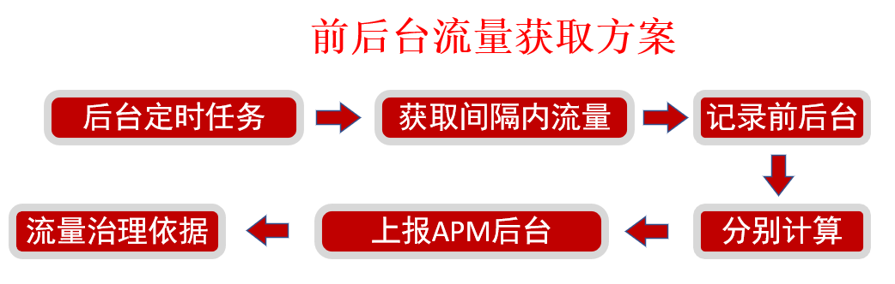

# 第8章 App网络优化

> 本章节带领大家一起学习网络优化相关工具、优化纬度、监控及优化具体方案等，从而获取线上用户真实的流量消耗、网络使用情况，同时会介绍关于网络的体系化建设方案。

##  8-1 网络优化从哪些纬度开展?

### 网络优化介绍

* 网络优化的纬度：多维
* 仅仅重视流量不够
* 网络流量的消耗量：精确
* 整体均值掩盖单点问题
* 网络相关监控：全面
* 粗粒度监控不能帮助我们发现、解决深层次问题

### 网络优化纬度

* 流量消耗
  * 一段时间流量消耗的精准度量，网络类型、前后台
  * 监控相关：用户流量消耗均值、异常率（消耗多、次数多）
  * 完整链路全部监控（Request、Response），主动上报
* 网络请求质量
  * 用户体验：请求速度、成功率
  * 监控相关：请求时长、业务成功率、失败率、Top失败接口
* 其它
  * 公司成本：带宽、服务器数、CDN
  * 耗电

### 网络优化误区

* 只关注流量消耗，忽视其它纬度
* 只关注均值、整体，忽视个体

## 8-2 网络优化工具选择

### 1、Network Profiler

* 显示实时网络活动：发送、接收数据及连接数
* 需要启动高级分析
* 只支持HttpURLConnection和OkHttp网络库
* Android Studio 启用高级功能：Run/Edit Configurations > Profiling
  * Enable advanced profiling  (required for API level < 26 only)

### 2、抓包工具

* Charles
  * 断点功能
  * Map Local
  * 弱网环境模拟
* Fiddler
* Wireshark
* TcpDump

### 3、Stetho

* com.facebook.stetho:stetho-okhttp3:1.5.0
* Stetho.initializeWithDefaults(this);
* addNetworkInterceptor
* Chrome浏览器：chrome://inspect

## 8-3 精准获取流量消耗实战

> 目录
>
> * 线上线下流量获取
> * 前台后台流量获取

### 1、问题思考

* 如何判断App流量消耗偏高
  * 绝对值看不出高低
  * 对比竞品，相同Case对比流量消耗
  * 异常监控超过正常指标

### 2、测试方案

* 1、设置----流量管理
* 2、抓包工具：只允许本App联网
* 3、可以解决大多数问题，但是线上场景线下可能遇不到

### 3、线上流量获取方案

* 1、TrafficStats: API8以上重启以来的流量数据统计
* 2、getUidRxBytes(int uid)指定Uid的接收流量
* 3、getTotalTxBytes()总发送流量

### 4、TrafficStats总结

无法获取某个时间段内的流量消耗

### 5、线上流量获取方案

* NetworkStatsManager: API23之后流量统计
* 可获取指定时间间隔内的流量信息
* 可获取不同网络类型下的消耗

### 6、前后台流量获取方案

* 难题：线上反馈App后台跑流量
* 只获取一个时间段的值不够全面

#### 前后台流量获取方案总结

* 有一定误差，可接受范围内
* 结合精细化的流量异常报警针对性的解决后台跑流量