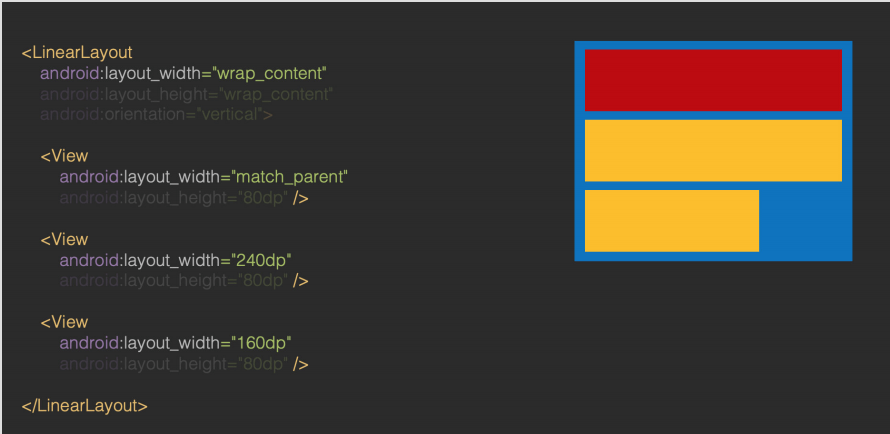
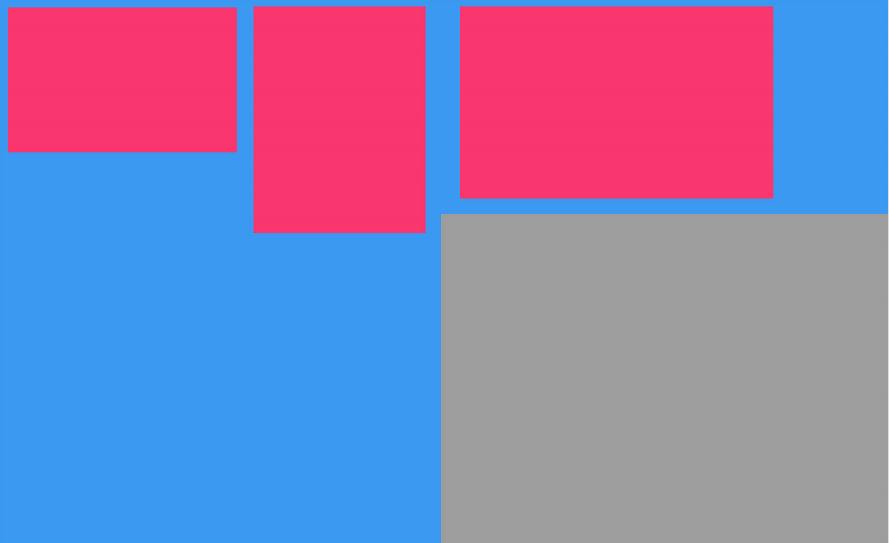

## 布局过程

> 项目名：CustomViewLayoutProcess

* 确定每个 View 的位置和尺寸
* 作用：为绘制和触摸范围做支持
  * 绘制：知道往哪里绘制
  * 触摸反馈：知道用户点的是哪里

## 流程，从整体看

* 测量流程：从根 View 递归调用每一级子 View 的 measure() 方法，对它们进行测量
* 布局流程：从根 View 递归调用每一级子 View 的 layout() 方法，把测量过程得出的子 View 的位置和尺寸传给子 View，子 View 保存

* 为什么要分两个流程？

  因为可能会重复测量

## 从个体看，对于每个 View

* 运行前，开发者在xml文件里写入对View的布局要求 layout_xxx
* 父 View 在自己的 onMeasure() 中，根据开发者在  xml 中写的对子 View 的要求，和自己的可用空间，得出对子 View 的具体尺寸要求

* 子 View 在自己的 onMeasure() 中，根据父 View 的要求和自己的特性算出自己的期望尺寸

  * 如果是 ViewGroup，还会在这里调用每个子 View 的 measure() 进行测量

* 父 View 在子 View 计算出期望尺寸后，得出子View的实际尺寸和位置

* 子 View 在自己的 layout() 方法中，将父 View 传进来的自己的实际尺寸和位置保存

  * 如果是 ViewGroup，还会在 onLayout() 里调用每个子 View 的layout() 把它们的尺寸位置传给它们

  