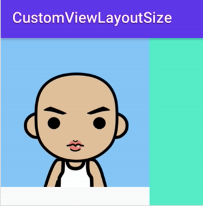
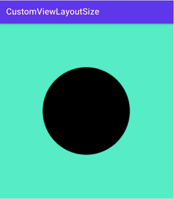

# 自定义布局：尺寸的⾃定义

> 项目名：CustomViewLayoutSize

## 简单改写已有 View 的尺寸

* 重写 onMeasure()

* 用 getMeasureWidth() 和 getMeasureHeight() 获取到测量出的尺寸

* 计算出最终要的尺寸

* 用 setMeasuredDimension(width, height) 把结果保存

* 例子：SquareImageView

  

```kotlin
package com.hencoder.layoutsize.view

class SquareImageView(context: Context?, attrs: AttributeSet?) : AppCompatImageView(context, attrs) {
  override fun onMeasure(widthMeasureSpec: Int, heightMeasureSpec: Int) {
    super.onMeasure(widthMeasureSpec, heightMeasureSpec)

    val size = min(measuredWidth, measuredHeight)

    setMeasuredDimension(size, size)
  }
}
```

xml

```xml
<?xml version="1.0" encoding="utf-8"?>
<LinearLayout xmlns:android="http://schemas.android.com/apk/res/android"
    xmlns:tools="http://schemas.android.com/tools"
    android:layout_width="match_parent"
    android:layout_height="match_parent"
    tools:context=".MainActivity">

    <com.hencoder.layoutsize.view.SquareImageView
        android:layout_width="300dp"
        android:layout_height="400dp"
        android:scaleType="centerCrop"                                         
        android:background="@drawable/avatar_rengwuxian" />

</LinearLayout>
```

## 完全自定义 View 的尺寸

* 重写 onMeasure()
* 计算出自己的尺寸
* 用resolveSize() 或者 resolveSizeAndState() 修正结果
* 使用 setMeasuredDimension(width, height) 保存结果
* 例子：CircleView



```kotlin
class CircleView(context: Context?, attrs: AttributeSet?) : View(context, attrs) {
  private val paint = Paint(Paint.ANTI_ALIAS_FLAG)

  override fun onMeasure(widthMeasureSpec: Int, heightMeasureSpec: Int) {
    val size = ((PADDING + RADIUS) * 2).toInt()

//    val specWidthMode = MeasureSpec.getMode(widthMeasureSpec)
//    val specWidthSize = MeasureSpec.getSize(widthMeasureSpec)
//    val width = when (specWidthMode) {
//      MeasureSpec.EXACTLY -> specWidthSize
//      MeasureSpec.AT_MOST -> if (size > specWidthSize) specWidthSize else size
//      else -> size
//    }
    // resolveSize方法就是上面注释代码所做的事情
    val width = resolveSize(size, widthMeasureSpec)
    val height = resolveSize(size, heightMeasureSpec)
    setMeasuredDimension(width, height)
  }

  override fun onDraw(canvas: Canvas) {
    super.onDraw(canvas)

    canvas.drawCircle(PADDING + RADIUS, PADDING + RADIUS, RADIUS, paint)
  }
}
```

xml

```xml
<?xml version="1.0" encoding="utf-8"?>
<LinearLayout xmlns:android="http://schemas.android.com/apk/res/android"
    xmlns:tools="http://schemas.android.com/tools"
    android:layout_width="match_parent"
    android:layout_height="match_parent"
    tools:context=".MainActivity">

    <com.hencoder.layoutsize.view.CircleView
        android:layout_width="wrap_content"
        android:layout_height="wrap_content"
        android:background="@color/colorAccent" />

</LinearLayout>
```

