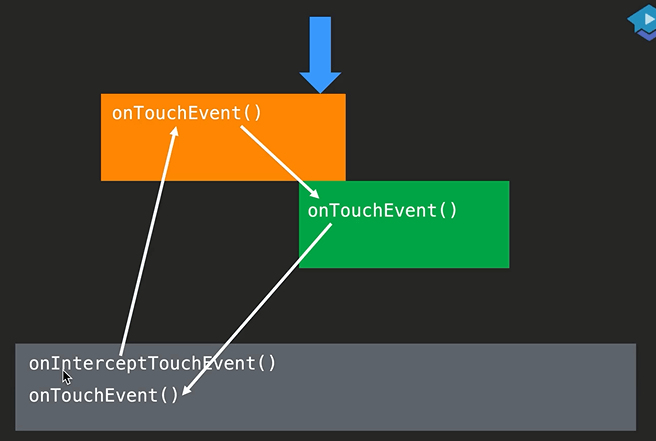
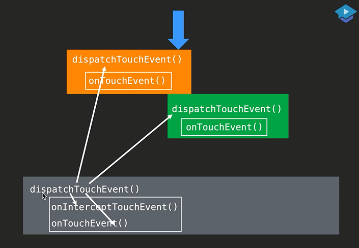
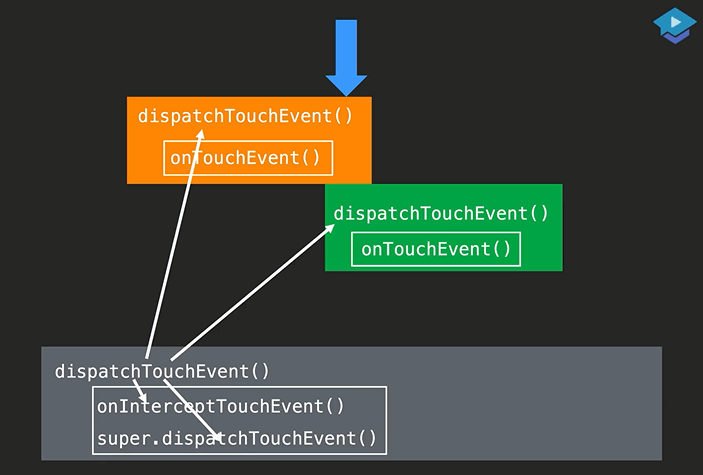

## View onTouchEvent

```java
public boolean onTouchEvent(MotionEvent event) {
    final float x = event.getX();
    final float y = event.getY();
    final int viewFlags = mViewFlags;
    final int action = event.getAction();

    final boolean clickable = ((viewFlags & CLICKABLE) == CLICKABLE
                               || (viewFlags & LONG_CLICKABLE) == LONG_CLICKABLE)
        || (viewFlags & CONTEXT_CLICKABLE) == CONTEXT_CLICKABLE;

    if ((viewFlags & ENABLED_MASK) == DISABLED) {
        if (action == MotionEvent.ACTION_UP && (mPrivateFlags & PFLAG_PRESSED) != 0) {
            setPressed(false);
        }
        mPrivateFlags3 &= ~PFLAG3_FINGER_DOWN;
        // A disabled view that is clickable still consumes the touch
        // events, it just doesn't respond to them.
        return clickable;
    }
    if (mTouchDelegate != null) {
        if (mTouchDelegate.onTouchEvent(event)) {
            return true;
        }
    }

    if (clickable || (viewFlags & TOOLTIP) == TOOLTIP) {
        switch (action) {
            case MotionEvent.ACTION_UP:
                mPrivateFlags3 &= ~PFLAG3_FINGER_DOWN;
                if ((viewFlags & TOOLTIP) == TOOLTIP) {
                    //延迟1.5秒让Tooltip消失
                    handleTooltipUp();
                }
                if (!clickable) {
                    removeTapCallback();
                    removeLongPressCallback();
                    mInContextButtonPress = false;
                    mHasPerformedLongPress = false;
                    mIgnoreNextUpEvent = false;
                    break;
                }
                boolean prepressed = (mPrivateFlags & PFLAG_PREPRESSED) != 0;
                //要么是按下状态，要么是预按下状态
                if ((mPrivateFlags & PFLAG_PRESSED) != 0 || prepressed) {
                    // take focus if we don't have it already and we should in
                    // touch mode.
                    boolean focusTaken = false;
                    //在纯触摸模式下
                    //EditText在触摸状态下也是需要焦点的，点一下变成了编辑模式了
                    if (isFocusable() && isFocusableInTouchMode() && !isFocused()) {
                        //获取焦点
                        focusTaken = requestFocus();
                    }
                    //系列动作1-按下
                    //如果是预按下（预点击）
                    //你的手在刚才按下去的时候，因为你是在一个滑动控件里面，那么此时先不设置为按下，另外在100毫秒之后再设置为按下，可是还没到100毫秒，手指就抬起来了，那么就会进入到这段代码，会触发点击，只是触发点击还不够，还需要让用户看到控件被点击了一下，所以需要把按下状态设置为true。同时用户已经松手了，导致状态变为按下，所以不止需要按下，还得抬起，将按下和抬起变成一个系列的操作，代码见下面的if (prepressed) { postDelayed(...
                    if (prepressed) {
                        // The button is being released before we actually
                        // showed it as pressed.  Make it show the pressed
                        // state now (before scheduling the click) to ensure
                        // the user sees it.
                        //按下状态设置为true
                        setPressed(true, x, y);
                    }

                    if (!mHasPerformedLongPress && !mIgnoreNextUpEvent) {
                        // This is a tap, so remove the longpress check
                        removeLongPressCallback();

                        // Only perform take click actions if we were in the pressed state
                        if (!focusTaken) {
                            // Use a Runnable and post this rather than calling
                            // performClick directly. This lets other visual state
                            // of the view update before click actions start.
                            if (mPerformClick == null) {
                                mPerformClick = new PerformClick();
                            }
                            if (!post(mPerformClick)) {
                                //触发点击监听
                                performClickInternal();
                            }
                        }
                    }

                    if (mUnsetPressedState == null) {
                        mUnsetPressedState = new UnsetPressedState();
                    }
					//如果是预按下（预点击）
                    if (prepressed) {
                        //系列动作2-抬起
                       	//设置一个延迟操作，64毫秒后将按下状态置空
                        postDelayed(mUnsetPressedState,
                                    ViewConfiguration.getPressedStateDuration());
                    } else if (!post(mUnsetPressedState)) {
                        // If the post failed, unpress right now
                        mUnsetPressedState.run();
                    }

                    removeTapCallback();
                }
                mIgnoreNextUpEvent = false;
                break;

            case MotionEvent.ACTION_DOWN:
                //手指头摸上去就叫SOURCE_TOUCHSCREEN，实体按键就不叫这个
                if (event.getSource() == InputDevice.SOURCE_TOUCHSCREEN) {
                    mPrivateFlags3 |= PFLAG3_FINGER_DOWN;
                }
                mHasPerformedLongPress = false;

                if (!clickable) {
                    //检查是否有设置tooltipText
                    checkForLongClick(
                        ViewConfiguration.getLongPressTimeout(),
                        x,
                        y,
                        TOUCH_GESTURE_CLASSIFIED__CLASSIFICATION__LONG_PRESS);
                    break;
                }
                //鼠标右键点击
                if (performButtonActionOnTouchDown(event)) {
                    break;
                }

                // Walk up the hierarchy to determine if we're inside a scrolling container.
                //是否在滑动控件内
                boolean isInScrollingContainer = isInScrollingContainer();

                // For views inside a scrolling container, delay the pressed feedback for
                // a short period in case this is a scroll.
                if (isInScrollingContainer) {
                    mPrivateFlags |= PFLAG_PREPRESSED;
                    if (mPendingCheckForTap == null) {
                        mPendingCheckForTap = new CheckForTap();
                    }
                    mPendingCheckForTap.x = event.getX();
                    mPendingCheckForTap.y = event.getY();
                    postDelayed(mPendingCheckForTap, ViewConfiguration.getTapTimeout());
                } else {
                    // Not inside a scrolling container, so show the feedback right away
                    //标记为按下状态
                    setPressed(true, x, y);
                    //设置长按的等待器，如果马上按下松手了，就触发点击；如果按下500毫秒后手指还未抬起来，就触发长按
                    checkForLongClick(
                        ViewConfiguration.getLongPressTimeout(),
                        x,
                        y,
                        TOUCH_GESTURE_CLASSIFIED__CLASSIFICATION__LONG_PRESS);
                }
                break;

            case MotionEvent.ACTION_CANCEL:
                //纯擦屁股
                if (clickable) {
                    setPressed(false);
                }
                removeTapCallback();
                removeLongPressCallback();
                mInContextButtonPress = false;
                mHasPerformedLongPress = false;
                mIgnoreNextUpEvent = false;
                mPrivateFlags3 &= ~PFLAG3_FINGER_DOWN;
                break;

            case MotionEvent.ACTION_MOVE:
                if (clickable) {
                    //5.0以后按钮波纹效果中心点
                    drawableHotspotChanged(x, y);
                }
				//如果你的分类是未定的（目前系统还无法判断用户是要干嘛，是要长按？是要做全局手势？，是要做点击？目前还不知道），那么就把长按时间加长
                final int motionClassification = event.getClassification();
                final boolean ambiguousGesture =
                    motionClassification == MotionEvent.CLASSIFICATION_AMBIGUOUS_GESTURE;
                int touchSlop = mTouchSlop;
                if (ambiguousGesture && hasPendingLongPressCallback()) {
                    if (!pointInView(x, y, touchSlop)) {
                        // The default action here is to cancel long press. But instead, we
                        // just extend the timeout here, in case the classification
                        // stays ambiguous.
                        removeLongPressCallback();
                        long delay = (long) (ViewConfiguration.getLongPressTimeout()
                                             * mAmbiguousGestureMultiplier);
                        // Subtract the time already spent
                        delay -= event.getEventTime() - event.getDownTime();
                        checkForLongClick(
                            delay,
                            x,
                            y,
                            TOUCH_GESTURE_CLASSIFIED__CLASSIFICATION__LONG_PRESS);
                    }
                    touchSlop *= mAmbiguousGestureMultiplier;
                }

                // Be lenient about moving outside of buttons
                //如果手出界了（手指位置移出了view）
                //touchSlop：触摸边界的额外边界
                if (!pointInView(x, y, touchSlop)) {
                    // Outside button
                    // Remove any future long press/tap checks
                    removeTapCallback();
                    removeLongPressCallback();
                    if ((mPrivateFlags & PFLAG_PRESSED) != 0) {
                        setPressed(false);
                    }
                    mPrivateFlags3 &= ~PFLAG3_FINGER_DOWN;
                }

                //用力按，直接触发长按
                final boolean deepPress =
                    motionClassification == MotionEvent.CLASSIFICATION_DEEP_PRESS;
                if (deepPress && hasPendingLongPressCallback()) {
                    // process the long click action immediately
                    removeLongPressCallback();
                    checkForLongClick(
                        0 /* send immediately */,
                        x,
                        y,
                        TOUCH_GESTURE_CLASSIFIED__CLASSIFICATION__DEEP_PRESS);
                }

                break;
        }

        return true;
    }

    return false;
}
```

MotionEvent.ACTION_DOWN核心代码：

```java
//标记为按下状态
setPressed(true, x, y);
//设置长按的等待器，如果马上按下松手了，就触发点击；如果按下500毫秒后手指还未抬起来，就触发长按
checkForLongClick(
    ViewConfiguration.getLongPressTimeout(),
    x,
    y,
    TOUCH_GESTURE_CLASSIFIED__CLASSIFICATION__LONG_PRESS);
```



就像生产线一样，是一个回路，首先父view（ViewGroup）的 `onInterceptTouchEvent` 会被调用，判断我要不要拦截，每一个实践组里的每一个事件，你的父view都要先调用这个 `onInterceptTouchEvent` ，让我看看这个事件我要不要拦截，我不拦截，则下一步，交给最上面的子view `onTouchEvent`

，如果我不用，则继续交给下一个子view。直到所有的子view都不用，这个时候又回到父view，交给父view的 `onTouchEvent`

**父view有两个判断**，一个是我要不要拦截 `onInterceptTouchEvent` ，一个是我要不要消费 `onTouchEvent`

如果这个父view下面还有父view呢？那就是最下面的父view的 `onInterceptTouchEvent`  先调用，然后再给上面这个父view的 `onInterceptTouchEvent` 

**总之就是：**最下面的父view的 `onInterceptTouchEvent` 、 `onInterceptTouchEvent` **往上** ，然后到最上面子view的 `onTouchEvent`、 `onTouchEvent` **再往下**

父view的 `onInterceptTouchEvent` 返回true，表示你要抢夺，一旦抢夺，事件只会交给父view的  `onTouchEvent`，不再给子view了，当她第一次返回true的时候，也是最后一次返回true的时候，也是她最后调用自己的时候；当她返回true后，以后再也不会调用 `onInterceptTouchEvent` 了。事件直接交给自己的  `onTouchEvent`处理了。

一旦我抢了，以后不会再调用 `onInterceptTouchEvent` 了，以后的事件只会交给自己的 `onTouchEvent`处理了。不会再给子view传递后续事件了

**注意：**所有的ViewGroup一旦重写了 `onInterceptTouchEvent` ，那么一定要重写  `onTouchEvent`，想想，你为什么要拦截？不就是为了要使用吗！

在需要拦截的情况下才返回true，其他情况需要返回false，因为你需要给子view一个接收事件的机会。

 `onInterceptTouchEvent` **需要注意的两点：**

* 开始的时候别拦截，需要的时候才去拦截返回true
* 在拦截的判断过程中，时刻做好拦截之后的准备工作，去记录各种事件，记录各种坐标，记录各种速度



终极版



## View 的触摸反馈

* 重写 onTouchEvent()，在方法内部定制触摸反馈算法

## 自定义 ViewGroup 的触摸反馈

* 除了重写 onTouchEvent()，还需要重写 onInterceptTouchEvent()
* onInterceptTouchEvent() 不用在第一时间返回 true，而是在任意事件，需要拦截的时候返回 true 就行

### View 的 dispatchTouchEvent

简化模型

```java
public boolean dispatchTouchEvent(MotionEvent event) {
    return onTouchEvent();
}
```

完整源代码

```java
public boolean dispatchTouchEvent(MotionEvent event) {
    // If the event should be handled by accessibility focus first.
    if (event.isTargetAccessibilityFocus()) {
        // We don't have focus or no virtual descendant has it, do not handle the event.
        if (!isAccessibilityFocusedViewOrHost()) {
            return false;
        }
        // We have focus and got the event, then use normal event dispatch.
        event.setTargetAccessibilityFocus(false);
    }
    boolean result = false;

    if (mInputEventConsistencyVerifier != null) {
        mInputEventConsistencyVerifier.onTouchEvent(event, 0);
    }

    final int actionMasked = event.getActionMasked();
    if (actionMasked == MotionEvent.ACTION_DOWN) {
        // Defensive cleanup for new gesture
        stopNestedScroll();
    }

    if (onFilterTouchEventForSecurity(event)) {
        if ((mViewFlags & ENABLED_MASK) == ENABLED && handleScrollBarDragging(event)) {
            result = true;
        }
        //noinspection SimplifiableIfStatement
        ListenerInfo li = mListenerInfo;
        if (li != null && li.mOnTouchListener != null
            && (mViewFlags & ENABLED_MASK) == ENABLED
            && li.mOnTouchListener.onTouch(this, event)) {
            result = true;
        }

        if (!result && onTouchEvent(event)) {
            result = true;
        }
    }

    if (!result && mInputEventConsistencyVerifier != null) {
        mInputEventConsistencyVerifier.onUnhandledEvent(event, 0);
    }

    // Clean up after nested scrolls if this is the end of a gesture;
    // also cancel it if we tried an ACTION_DOWN but we didn't want the rest
    // of the gesture.
    if (actionMasked == MotionEvent.ACTION_UP ||
        actionMasked == MotionEvent.ACTION_CANCEL ||
        (actionMasked == MotionEvent.ACTION_DOWN && !result)) {
        stopNestedScroll();
    }

    return result;
}
```

**核心代码**

```java
//noinspection SimplifiableIfStatement
ListenerInfo li = mListenerInfo;
if (li != null && li.mOnTouchListener != null
    && (mViewFlags & ENABLED_MASK) == ENABLED
    && li.mOnTouchListener.onTouch(this, event)) {
    result = true;
}

if (!result && onTouchEvent(event)) {
    result = true;
}
```

什么是OnTouchListener?

这个 `OnTouchListener` 就像是 View 的 `OnClickListener` ，你可以给每个View设置一个Listener，这样就可以不用去写一个自定义View，就能够定义它的那些触摸代码了，是这么一个外挂 Listener，它工作的位置会靠前一点，先判断 `li.mOnTouchListener` ，然后再判断 `onTouchEvent`, 如果 `li.mOnTouchListener.onTouch(this, event)` 返回的是true，那么我就不看我的 `onTouchEvent` 了。

这是Android对外提供的一个机制，让你可以不用去重写、不用去继承某一个View，也能去修改它的触摸算法。

### ViewGroup 的 dispatchTouchEvent

View的 dispatchTouchEvent 简化模型

```java
public class View {
    public boolean dispatchTouchEvent(MotionEvent event) {
        return onTouchEvent();
    }
}
```

ViewGroup 的dispatchTouchEvent 简化模型

```java
public boolean dispatchTouchEvent(MotionEvent event) {
    boolean result;
    if(interceptTouchEvent()) {
        result = onTouchEvent();// super.dispatchTouchEvent
    } else {
        result = 子View的 dispatchTouchEvent
    }
    return result; 
}
```

ViewGroup 的 dispatchTouchEvent源码

```java
public boolean dispatchTouchEvent(MotionEvent ev) {
    //....
    boolean handled = false;
    if (onFilterTouchEventForSecurity(ev)) {
        final int action = ev.getAction();
        final int actionMasked = action & MotionEvent.ACTION_MASK;

        // Handle an initial down.
        if (actionMasked == MotionEvent.ACTION_DOWN) {
            // Throw away all previous state when starting a new touch gesture.
            // The framework may have dropped the up or cancel event for the previous gesture
            // due to an app switch, ANR, or some other state change.
            //第1步，重置
            //重置，确保没有任何一个子View是被按着的
            cancelAndClearTouchTargets(ev);
            //在用户松手之后需要重置，让你的父View能够在下一次事件序列里面正常拦截你
            resetTouchState();
        }

        // Check for interception.
        //第2步，拦截处理
        //mFirstTouchTarget：是被按下，被触摸到的那些子View，是用一个链表来做的
        final boolean intercepted;
        if (actionMasked == MotionEvent.ACTION_DOWN
            || mFirstTouchTarget != null) {
            final boolean disallowIntercept = (mGroupFlags & FLAG_DISALLOW_INTERCEPT) != 0;
            //检查子View是否调用了requestDisallowInterceptTouchEvent
            //如果子View告诉你不要拦截，则进入到else代码块
            if (!disallowIntercept) {
                //是否需要拦截
                intercepted = onInterceptTouchEvent(ev);
                ev.setAction(action); // restore action in case it was changed
            } else {
                intercepted = false;
            }
        } else {
            // There are no touch targets and this action is not an initial down
            // so this view group continues to intercept touches.
            intercepted = true;
        }

        // If intercepted, start normal event dispatch. Also if there is already
        // a view that is handling the gesture, do normal event dispatch.
        if (intercepted || mFirstTouchTarget != null) {
            ev.setTargetAccessibilityFocus(false);
        }

        // Check for cancelation.
        final boolean canceled = resetCancelNextUpFlag(this)
            || actionMasked == MotionEvent.ACTION_CANCEL;

        // Update list of touch targets for pointer down, if needed.
        final boolean isMouseEvent = ev.getSource() == InputDevice.SOURCE_MOUSE;
        final boolean split = (mGroupFlags & FLAG_SPLIT_MOTION_EVENTS) != 0
            && !isMouseEvent;
        TouchTarget newTouchTarget = null;
        boolean alreadyDispatchedToNewTouchTarget = false;
        if (!canceled && !intercepted) {
            // If the event is targeting accessibility focus we give it to the
            // view that has accessibility focus and if it does not handle it
            // we clear the flag and dispatch the event to all children as usual.
            // We are looking up the accessibility focused host to avoid keeping
            // state since these events are very rare.
            View childWithAccessibilityFocus = ev.isTargetAccessibilityFocus()
                ? findChildWithAccessibilityFocus() : null;
			//第3步，多点触控的情况
            if (actionMasked == MotionEvent.ACTION_DOWN
                || (split && actionMasked == MotionEvent.ACTION_POINTER_DOWN)
                || actionMasked == MotionEvent.ACTION_HOVER_MOVE) {
                final int actionIndex = ev.getActionIndex(); // always 0 for down
                final int idBitsToAssign = split ? 1 << ev.getPointerId(actionIndex)
                    : TouchTarget.ALL_POINTER_IDS;

                // Clean up earlier touch targets for this pointer id in case they
                // have become out of sync.
                removePointersFromTouchTargets(idBitsToAssign);

                final int childrenCount = mChildrenCount;
                if (newTouchTarget == null && childrenCount != 0) {
                    final float x =
                        isMouseEvent ? ev.getXCursorPosition() : ev.getX(actionIndex);
                    final float y =
                        isMouseEvent ? ev.getYCursorPosition() : ev.getY(actionIndex);
                    // Find a child that can receive the event.
                    // Scan children from front to back.
                    final ArrayList<View> preorderedList = buildTouchDispatchChildList();
                    final boolean customOrder = preorderedList == null
                        && isChildrenDrawingOrderEnabled();
                    final View[] children = mChildren;
                    for (int i = childrenCount - 1; i >= 0; i--) {
                        final int childIndex = getAndVerifyPreorderedIndex(
                            childrenCount, i, customOrder);
                        final View child = getAndVerifyPreorderedView(
                            preorderedList, children, childIndex);
                        if (!child.canReceivePointerEvents()
                            || !isTransformedTouchPointInView(x, y, child, null)) {
                            continue;
                        }
						//第4步，尝试获取目前触摸的点，有木有正在触摸当中的子View
                        //Gets the touch target for specified child view.
                        newTouchTarget = getTouchTarget(child);
                        if (newTouchTarget != null) {
                            // Child is already receiving touch within its bounds.
                            // Give it the new pointer in addition to the ones it is handling.
                            //把这些点并入进去
                            newTouchTarget.pointerIdBits |= idBitsToAssign;
                            break;
                        }

                        resetCancelNextUpFlag(child);
                        //第5步，尝试查找，看能不能找到一个新的子View，它接收到这个事件，如果能接收到，则把它加入到新的TouchTarget
                        //dispatchTransformedTouchEvent：我的位置到子View的位置，未必就是那个位置，我的这个事件到子View那儿未必就是这个事件，需要做一个偏移。比如这个事件在我这儿是个ACTION_POINTER_DOWN，到了子View就变成了ACTION_DOWN，这些偏移和转换都需要做的
                        if (dispatchTransformedTouchEvent(ev, false, child, idBitsToAssign)) {
                            // Child wants to receive touch within its bounds.
                            mLastTouchDownTime = ev.getDownTime();
                            if (preorderedList != null) {
                                // childIndex points into presorted list, find original index
                                for (int j = 0; j < childrenCount; j++) {
                                    if (children[childIndex] == mChildren[j]) {
                                        mLastTouchDownIndex = j;
                                        break;
                                    }
                                }
                            } else {
                                mLastTouchDownIndex = childIndex;
                            }
                            mLastTouchDownX = ev.getX();
                            mLastTouchDownY = ev.getY();
                            newTouchTarget = addTouchTarget(child, idBitsToAssign);
                            alreadyDispatchedToNewTouchTarget = true;
                            break;
                        }

                        // The accessibility focus didn't handle the event, so clear
                        // the flag and do a normal dispatch to all children.
                        ev.setTargetAccessibilityFocus(false);
                    }
                    if (preorderedList != null) preorderedList.clear();
                }

                if (newTouchTarget == null && mFirstTouchTarget != null) {
                    // Did not find a child to receive the event.
                    // Assign the pointer to the least recently added target.
                    newTouchTarget = mFirstTouchTarget;
                    while (newTouchTarget.next != null) {
                        newTouchTarget = newTouchTarget.next;
                    }
                    newTouchTarget.pointerIdBits |= idBitsToAssign;
                }
            }
        }

        // Dispatch to touch targets.
        //第6步，处理完子View之后，如果没有TouchTarget，表示没有任何一个子View接收事件。那么就调用自己的dispatchTransformedTouchEvent，相当于调用自己的OnTouchEvent
        if (mFirstTouchTarget == null) {
            // No touch targets so treat this as an ordinary view.
            handled = dispatchTransformedTouchEvent(ev, canceled, null,
                                                    TouchTarget.ALL_POINTER_IDS);
        } else {
            // Dispatch to touch targets, excluding the new touch target if we already
            // dispatched to it.  Cancel touch targets if necessary.
            TouchTarget predecessor = null;
            TouchTarget target = mFirstTouchTarget;
            //第7步，如果有子View接收事件，遍历链表，看看每一个子View是否需要偏移转换（除了上面第5步新添加的子View），如果需要，则做一次
            while (target != null) {
                final TouchTarget next = target.next;
                if (alreadyDispatchedToNewTouchTarget && target == newTouchTarget) {
                    handled = true;
                } else {
                    final boolean cancelChild = resetCancelNextUpFlag(target.child)
                        || intercepted;
                    if (dispatchTransformedTouchEvent(ev, cancelChild,
                                                      target.child, target.pointerIdBits)) {
                        handled = true;
                    }
                    if (cancelChild) {
                        if (predecessor == null) {
                            mFirstTouchTarget = next;
                        } else {
                            predecessor.next = next;
                        }
                        target.recycle();
                        target = next;
                        continue;
                    }
                }
                predecessor = target;
                target = next;
            }
        }

        // Update list of touch targets for pointer up or cancel, if needed.
        //第7步，擦屁股
        if (canceled
            || actionMasked == MotionEvent.ACTION_UP
            || actionMasked == MotionEvent.ACTION_HOVER_MOVE) {
            resetTouchState();
        } else if (split && actionMasked == MotionEvent.ACTION_POINTER_UP) {
            final int actionIndex = ev.getActionIndex();
            final int idBitsToRemove = 1 << ev.getPointerId(actionIndex);
            removePointersFromTouchTargets(idBitsToRemove);
        }
    }

    if (!handled && mInputEventConsistencyVerifier != null) {
        mInputEventConsistencyVerifier.onUnhandledEvent(ev, 1);
    }
    return handled;
}
```

**mFirstTouchTarget**：是那些被你内部被摸到的子View，是一个链表关系；通过 `dispatchTransformedTouchEvent` 处理多点触控的偏移和转换

