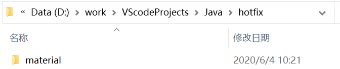

## .class文件编译成.dex文件does not match path问题解决

https://blog.csdn.net/u012911421/article/details/89705502

用dx工具把.class文件编译成.dex文件时出现路劲不匹配问题：

```java
➜ dx --dex --output=say_something_hotfix.jar say_something.jar

PARSE ERROR:
class name (material/danny_jiang/com/dexclassloaderhotfix/ISay) does not match path (ISay.class)
...while parsing ISay.class
1 error; aborting
```

如何解决呢，首先先配置下dx工具的环境变量，例如我的dx路劲：D:\Program\Android\Sdk\build-tools\29.0.2。加入环境变量path中即可.

复制material整个包文件夹到你的电脑下随便哪个盘都行，例如我的位置（D:\work\VScodeProjects\Java\hotfix）

需要拷贝的materia包文件夹：


拷贝的materia包文件夹所在路径



在AndroidStudio中找到编译后的class文件，或者在在hotfix目录下使用javac 命令编译java文件

```java
javac .\material\danny_jiang\com\dexclassloaderhotfix\ISay.java .\material\danny_jiang\com\dexclassloaderhotfix\SayHotFix.java
```

之后在复制到的那个文件夹路劲下执行：

```java
dx --dex --output=my.dex material\danny_jiang\com\dexclassloaderhotfix\*.class
```

这样就完成了把单个class文件转化成dex。

那如果是多个class文件呢？是不是要打包成一个jar包？，可以这么执行：

```java
dx --dex --output=say_something_hotfix.jar material\danny_jiang\com\dexclassloaderhotfix\*.class
```

这样就把路劲下所有的class文件打包成了jar，DexClassLoader可以的加载的jar。