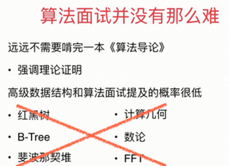

# 1-1 算法面试不仅仅是正确的回答问题

## 1.1.1 对一组数据进行排序

### 这组数据有什么样的特征？

* 有没有可能包含大量重复的元素？
  * 如果有这种可能的话，三路快排是更好地选择。
  * Java源代码其排序接口背后就是三路快排
* 是否大部分数据距离它正确的位置很近？是否近乎有序？
  * 如果是这样的话，插入排序是更好的选择。
* 是否数据的取值范围非常有限？比如对学生成绩排序。
  * 如果是这样的话，计数排序是更好地选择。

### 对排序有什么额外的要求？

* 是否需要稳定排序？

  * 如果是的话，归并排序是更好地选择。
### 数据的存储状况是怎样的？
  * 是否是使用链表存储的？
      * 如果是的话，归并排序是更好地选择。
* 数据的大小是否可以装载在内存里？
  * 数据量很大，或者内存很小，不足以装载在内存里，需要使用外排序算法。

## 1.1.2 什么是“正确”的回答一个算法问题

正确还包含对问题的独到见解；优化；代码规范；容错性；

这个课程不仅仅是给出解决算法问题的代码

如果是非常难的问题，对你的竞争对手来说，也是难的。

关键在于你所表达出的解决问题的思路。

甚至通过表达解题思路的方向，得出结论：这个问题的解决方案，应该在哪一个领域，我可以通过查阅或者进一步学习解决问题。

# 1-2 算法面试只是面试的一部分

## 1.2.1 算法面试优秀不意味着技术面试优秀

算法面试只是技术面试的一部分。

根据你的简历和应聘职位的不同，势必要考察其他技术方面。

 项目经历 和 项目 中遇到的实际问题

你遇到的印象最深的bug是什么？

面向对象

设计模式

网络相关；安全相关；内存相关；并发相关；.....

系统设计；scalability

## 1.2.2 技术面试优秀不意味着能够拿到Offer

技术面试只是面试的一部分。面试不仅仅是考察你的技术水平，还是了解你的过去以及形成的思考行为方式。

**关于过去：参与项目至关重要**

### 1.2.2.1 项目经历

* 工作人士
* 研究生
* 本科生
  * 毕业设计
  * 其他课程设计

### 1.2.2.2 如何找到项目？

* 实习
* 参与实战课程学习
  * 慕课网
  * Coursera
  * ....

### 1.2.2.3 创建自己的项目

* 自己做小应用：计划表；备忘录；播放器...
* 自己解决小问题：爬虫；数据分析；词频统计...
* “不是项目”的项目：一本优秀的技术书籍的代码整理等....
* 分享：自己的技术博客；github等等

### 1.2.2.4 通过过去了解你的思考行为方式

* 遇到的最大的挑战？
* 犯过的错误？
* 遭遇的失败？
* 最享受的工作内容？
* 遇到冲突的处理方式？
* 做的最与众不同的事儿？

### 1.2.2.5 准备好合适的问题问面试官

* 整个小组的大概运行模式是怎样的？
* 整个项目的后续规划是如何的？
* 这个产品中的某个问题是如何解决的？
* 为什么会选择某些技术？标准？
* 我对某个技术很感兴趣，在你的小组中我会有怎样的机会深入这种技术？

# 1-3 如何准备算法面试

## 1.3.1 算法面试并没有那么难

## 1.3.2 算法面试的准备范围

不要轻视基础算法和数据结构，而只关注“有意思”的题目

* 各种排序算法
* 基础数据结构和算法的实现：如堆、二叉树、图...
* 基础数据结构的使用：如链表、栈、队列、哈希表、图、Trie、并查集...
* 基础算法：深度优先、广度优先、二分查找、递归....
* 基本算法思想：递归、分治、回溯搜索、贪心、动态规划...

**推荐课程：算法&数据结构**

## 1.3.3 选择合适的OJ

* LeetCode
* HackerRank 对问题的分类很详细

## 1.3.4 在学习和实践做题之间，要掌握平衡

# 1-4 如何回答算法面试问题

### 优化算法

* 遍历常见的算法思路
* 遍历常见的数据结构
* 空间和时间的交换（哈希表）
* 预处理信息（排序）
* 在瓶颈处寻找答案：O(nlogn) + O(n^2);  O(n^3)

### 实际编写问题

* 极端条件的判断
  * -数组为空？字符串为空？数量为0？指针为NULL？
* 变量名
* 模块化，复用性

### 对于基本问题，白板编程

* 手写快排
* 手写归并排序算法
* 某一类基础数据结构的实现
  * 实现一个基本的最大堆、最小堆