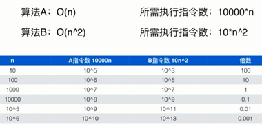
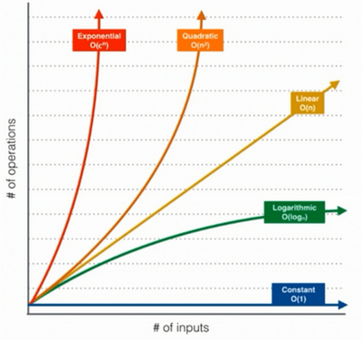
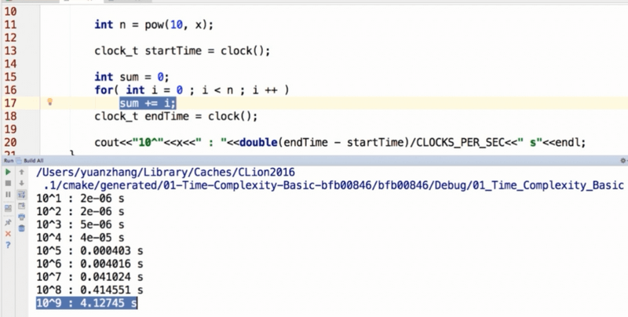
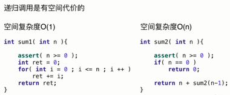
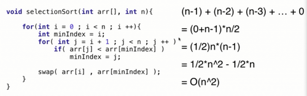
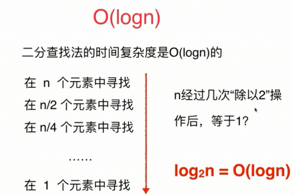
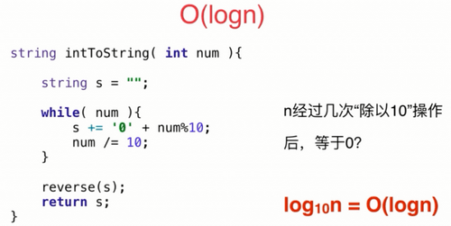
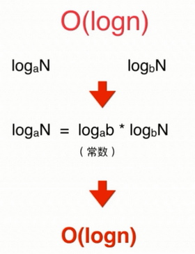

#  2-1 究竟什么是大O（Big O）

n表示数据规模

**O(f(n))表示运行算法所需要执行的指令数，和f(n)成正比。**

| 二分查找法 O(logn)             | 所需执行指令数：a*logn  |
| ------------------------------ | ----------------------- |
| 寻找数组中的最大值/最小值 O(n) | 所需执行指令数：b*n     |
| 归并排序算法 O(nlogn)          | 所需执行指令数：c*nlogn |
| 选择排序算法 O(n^2)            | 所需执行指令数：d*n^2   |





在学术界，严格地讲，O(f(n))表示算法执行的上界

归并排序算法的时间复杂度是O(nlogn)的，同时也是O(n^2)


在业界，我们就是使用O来表示算法执行的最低上界

我们一般不会说归并排序是O(n^2)的 

O( nlogn  + n ) = O( nlogn )

O( nlogn + n^2 ) = O( n^2 )

## 2.1.1 一个时间复杂度的问题

有一个字符串数组，将数组中的每一个字符串按照字母序排序；之后再将整个字符串数组按照字典序排序。整个操作的时间复杂度？

假设最长的字符串长度为s；数组中有n个字符串

对每个字符串排序：O(slogs)

将数组中的每一个字符串按照字母序排序：O(n*slog(s))

将整个字符串数组按照字典序排序：O(s*nlog(n))

```java
O(n*slog(s)) + O(s*nlog(n)) = O(n*s*logs + s*n*logn)
    						= O( n*s*(logs+logn))
```

## 2.1.2 算法复杂度在有些情况是用例相关的

| 插入排序算法 O(n^2) | 快速排序算法 O(nlogn) |
| ------------------- | --------------------- |
| 最差情况：O(n^2)    | 最差情况：O(n^2)      |
| 最好情况：O(n)      | 最好情况：O(nlogn)    |
| 平均情况：O(n^2)    | 平均情况：O(nlogn)    |

##  2-2 对数据规模有一个概念

O(n)级别的算法：



## 2.2.1 数据规模的概念

如果要想在1s之内解决问题：

O(n^2)的算法可以处理大约10^4级别的数据；

O(n)的算法可以处理大约10^8级别的数据；

O(nlogn)的算法可以处理大约10^7级别的数据；

## 2.2.2 空间复杂度

多开一个辅助的数组：O(n)

多开一个辅助的二维数组：O(n^2)

多开常数空间：O(1)



## 2-3 简单的复杂度分析

**O(1)**

```c
void swapTwoInts(int &a, int &b) {
    int temp = a;
    a = b;
    b = temp;
}
```

**O(n)**

```c
int sum( int n ) {
    int ret = 0;
    for( int i = 0; i <= n; i ++)
        ret += i;
    return ret;
}
```

**O(n)**

```c
// 字符串反转
void reverse( string &s ) {
    int n = s.size();
    for( int i = 0; i < n/2; i ++)
        swap( s[i], s[n-1-i] );
}
```

1/2*n次swap操作：O(n)

**O(n^2)**

选择排序



**O(n^2)?**

```c
void printInfomation(int n) {
    for( int i = 1; i <= n; i++)
        for( int j = 1; j <= 30; j++)
            cout<<"Class "<<i<<" - "<<"No. "<<j<<endl;
    return;
}
```

30次基本操作：O(n)

**O(logn)**

```c
int binarySearch(int arr[], int n, int target) {
    int l = 0, r = n-1;
    while( l <= r ){
        int mid = l + (r-l)/2;
        if( arr[mid] == target ) return mid;
        if( arr[mid] == target ) r = mid - 1;
        else l = mid + 1;
    }
    return -1;
}
```



整形转成字符串





**O(n^2)?**

```c
void hello(int n) {
    for( int sz = 1; sz < n ; sz += sz)
        for( int i = 1; i < n; i ++)
            cout<<"Hello, Algorithm!"<<endl;
}
```

**O(sqrt(n))**

```c
bool isPrime( int n ) {
    for(int x = 2; x*x <= n; x++)
        if (n%x == 0)
            return false;
    return true;
}
```

