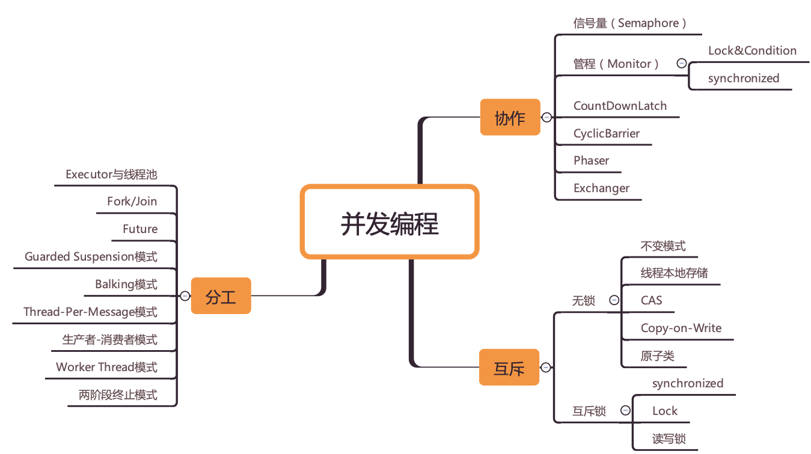

# 一、Android工程师进阶34讲 - 拉钩

# 二、丢物线 第五期

第46章、Annotation Processing

* [神兵利器Dagger2](https://zhuanlan.zhihu.com/p/24454466)

第55章、HashMap 源码解析

第56章、LeakCanary 源码解析

第57章、BlockCanary 源码解析

* [Android源码系列-解密BlockCanary](https://juejin.im/post/6844904083426377735)

第58章、深入理解 JVM

# 三、Java并发

## 3.1 Java并发编程实战 - 极客

> 作者推荐的相关书籍：
>
> 《Java并发编程实战》作者阵容可谓大师云集，也包括Doug Lea
> 《Java并发编程的艺术》讲解并发包内部实现原理，能读明白，内功大增
> 《图解Java多线程设计模式》并发编程设计模式方面的经典书籍
> 《操作系统：精髓与设计原理》经典操作系统教材
> http://ifeve.com 国内专业并发编程网站
> http://www.cs.umd.edu/~pugh/java/memoryModel/ 很多并发编程的早期资料都在这里

**其实并发编程可以总结为三个核心问题：分工、同步、互斥。**

所谓**分工**指的是如何高效地拆解任务并分配给线程，而**同步**指的是线程之间如何协作，互斥则是保证同一时刻只允许一个线程访问共享资源。Java SDK 并发包很大部分内容都是按照这三个维度组织的，例如 Fork/Join 框架就是一种分工模式，CountDownLatch 就是一种典型的同步方式，而可重入锁则是一种互斥手段。

当把并发编程核心的问题搞清楚，再回过头来看 Java SDK 并发包，你会感觉豁然开朗，它不过是针对并发问题开发出来的工具而已，此时的 SDK 并发包可以任你“盘”了。

而且，这三个核心问题是跨语言的，你如果要学习其他语言的并发编程类库，完全可以顺着这三个问题按图索骥。Java SDK 并发包其余的一部分则是并发容器和原子类，这些比较容易理解，属于辅助工具，其他语言里基本都能找到对应的

**所以，你说并发编程难学吗？**

首先，难是肯定的。因为这其中涉及操作系统、CPU、内存等等多方面的知识，如果你缺少某一块，那理解起来自然困难。其次，难不难学也可能因人而异，就我的经验来看，很多人在学习并发编程的时候，总是喜欢从点出发，希望能从点里找到规律或者本质，最后却把自己绕晕了。

我前面说过，并发编程并不是 Java 特有的语言特性，它是一个通用且早已成熟的领域。Java 只是根据自身情况做了实现罢了，当你理解或学习并发编程的时候，如果能够站在较高层面，系统且有体系地思考问题，那就会容易很多。

所以，我希望这个专栏更多地谈及问题背后的本质、问题的起源，同时站在理论、模型的角度讲解 Java 并发，让你的知识更成体系，融会贯通。最终让你能够得心应手地解决各种并发难题，同时将这些知识用于其他编程语言，让你的一分辛劳三分收获。

**并发编程全景图之思维导图**

## 3.2 Java并发编程的艺术

# 四、性能优化

## 4.1 国内Top团队大牛带你玩转Android性能分析与优化 - 慕课

## 4.2 JsonChao的性能优化专题博客

* [深入探索Android稳定性优化](https://juejin.im/post/6844903972587716621#heading-104)
* [深入探索Android卡顿优化（下）](https://juejin.im/post/6844904066259091469)

## 4.3 其他

[初恋·卡顿 (Matrix Android TraceCanary)](https://github.com/Tencent/matrix/wiki/Matrix-Android-TraceCanary)

[Android 中的卡顿丢帧原因概述 - 应用篇](https://androidperformance.com/2019/09/05/Android-Jank-Due-To-App/)

[Android trace文件抓取原理](https://www.jianshu.com/p/f406d535a8bc)

# 五、数据结构与算法

## 5.1 玩转算法面试 从真题到思维全面提升算法思维 - 慕课

## 5.2 算法与数据结构-综合提升 C++版 - 慕课

## 5.3 LeetCode 热题 HOT 100

https://leetcode-cn.com/problemset/leetcode-hot-100/

## 5.4 [花花酱 LeetCode 特辑/数据结构](https://space.bilibili.com/9880352/channel/detail?cid=50930)

# 六、Flutter

## 6.1 Flutter从入门到进阶 实战携程网App - 慕课

## 6.2 Flutter核心技术与实战 - 极客

# 七、「反思」系列

[那些消失的安卓技术博主们](https://juejin.im/post/6844904147997687816)

[反思|Android View机制设计与实现：测量流程](https://juejin.im/post/6844903909320835080)

# 八、题库

## [这是一份面向Android开发者的复习指南](https://www.jianshu.com/p/b3c1b9c6dd40)

> 相信很多同学都会有这样的感受，前三天刚刚复习的知识点，今天问的时候怎么就讲不出个所以然了呢？

## 8.0 【建议收藏】2020年中高级Android大厂面试秘籍，为你保驾护航金三银四，直通大厂（Android基础篇）

> [从几十份顶级面试仓库和300多篇高质量面经中总结出一份全面成体系化的Android高级面试题集。](https://juejin.im/post/6844904079160770568)

## 8.1 AndroidInterview-Q-A

> [国内一线互联网公司内部面试题库](https://github.com/JackyAndroid/AndroidInterview-Q-A)

## 8.2 interview_internal_reference

> [2020年最新总结，阿里，腾讯，百度，美团，头条等技术面试题目](https://github.com/0voice/interview_internal_reference)，以及答案，专家出题人分析汇总。持续更新中。

## 8.3  [Android 面试指南2019](https://xiaozhuanlan.com/android-interview) - 小专栏

## 8.4 interview

> [笔试面试知识整理](https://github.com/HIT-Alibaba/interview)

# 九、[译] Coding Interview University 一套完整的学习手册帮助自己准备 Google 的面试

> * 原文地址：[Coding Interview University](https://github.com/jwasham/coding-interview-university)

- 原文作者：[John Washam](https://github.com/jwasham)
- 译文出自：[掘金翻译计划](https://github.com/xitu/gold-miner)
- 译者：[aleen42](https://github.com/aleen42)，[Newton](https://github.com/Newt0n)，[bobmayuze](https://github.com/bobmayuze)，[Jaeger](https://github.com/laobie)，[sqrthree](https://github.com/sqrthree)